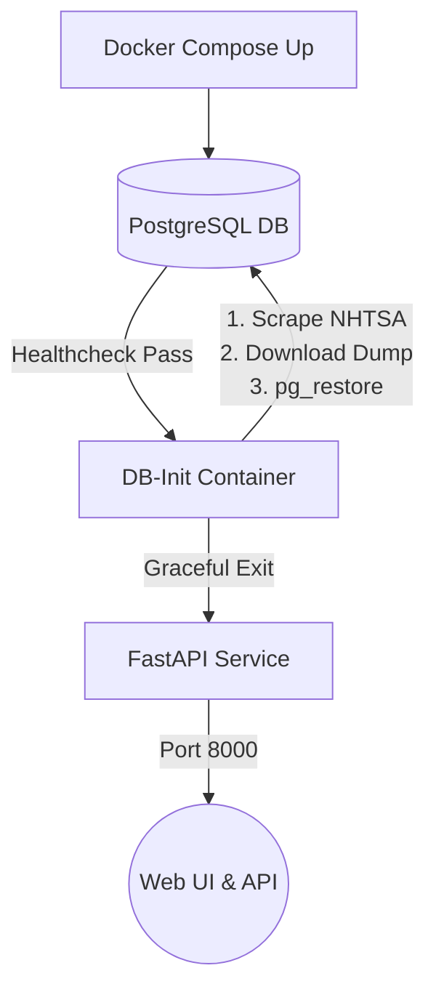

<div align="center">
  <h1>🚙 VPIC VIN API Service</h1>
  <p><i>A blazing-fast, self-hosted API to validate and decode Vehicle Identification Numbers (VINs) using the official NHTSA vPIC database.</i></p>

  [](https://hub.docker.com/r/tiborrr/vpic-api-service)
  [](https://fastapi.tiangolo.com/)
  [](https://www.postgresql.org/)
  [](https://www.python.org/)
</div>

---

## ✨ Features

- **⚡️ Blazing Fast:** Built on FastAPI with highly-optimized PostgreSQL `UNNEST` queries and native scalar functions.
- **🛡️ True DB Validation:** Connects to an actual PostgreSQL instance running the native NHTSA database structure for 100% offline accuracy—no rate limits, no network latency.
- **🔄 Auto-Initialization:** Our custom `db-init` container automatically scrapes NHTSA for the latest database dumps and gracefully restores them on startup.
- **📦 Bulk Validation:** Validate up to 100 VINs concurrently in a single network request.
- **🌐 HTMX Frontend:** Includes a sleek, modern, Javascript-free UI for decoding VINs right from your browser.
- **🐳 Docker Native:** Ready-to-use Docker images published automatically to Docker Hub.

---

## 🏗 Architecture

The application is fully containerized and orchestrates its own data lifecycle automatically:



---

## 🚀 Quick Start (Development)

The easiest way to run the service locally from source is using Docker Compose. This automatically spins up the database, initializes the NHTSA schema, builds the API from your local code, and launches it.

### 1. Configure Environment
Copy the example environment file (defaults are fine for local testing).
```bash
cp .env.example .env
```

### 2. Start the Stack
Bring up the entire stack in detached mode:
```bash
docker compose up -d
```
> **Note:** The `db-init` step downloads and restores a large PostgreSQL dump. It may take a few minutes for the API to become available on the very first run.

### 3. Access the Service
- **🖥️ Web UI:** [http://localhost:8000/](http://localhost:8000/)
- **📖 Swagger UI:** [http://localhost:8000/docs](http://localhost:8000/docs)
- **📚 ReDoc:** [http://localhost:8000/redoc](http://localhost:8000/redoc)

---

## 🐳 Production Deployment

If you want to deploy the API to a server without downloading the source code, you can use the production compose file which pulls the pre-built images directly from Docker Hub.

**1. Download the production files to your server:**
```bash
curl -O https://raw.githubusercontent.com/tiborrr/vpic-api-service/main/docker-compose.prod.yml
curl -o .env https://raw.githubusercontent.com/tiborrr/vpic-api-service/main/.env.example
```

**2. Start the production stack:**
```bash
docker compose -f docker-compose.prod.yml up -d
```
*(This is ideal for VPS deployments or production environments).*

---

## 📡 API Endpoints

| Endpoint | Method | Description |
|---|---|---|
| `/api/v1/vin/{vin}/simple` | `GET` | Extremely fast endpoint for basic validation, year, and WMI extraction. |
| `/api/v1/vin/bulk-simple` | `POST` | High-performance bulk endpoint. Pass a list of VINs in the JSON body. |
| `/api/v1/vin/{vin}/decode` | `GET` | Comprehensive decode endpoint using the `vpic.spvindecode` stored procedure. |

---

## 🧪 Testing

This project includes automated tests that run in an isolated Docker container against the real PostgreSQL schema to ensure flawless execution.

```bash
docker compose run --build --rm test
```
